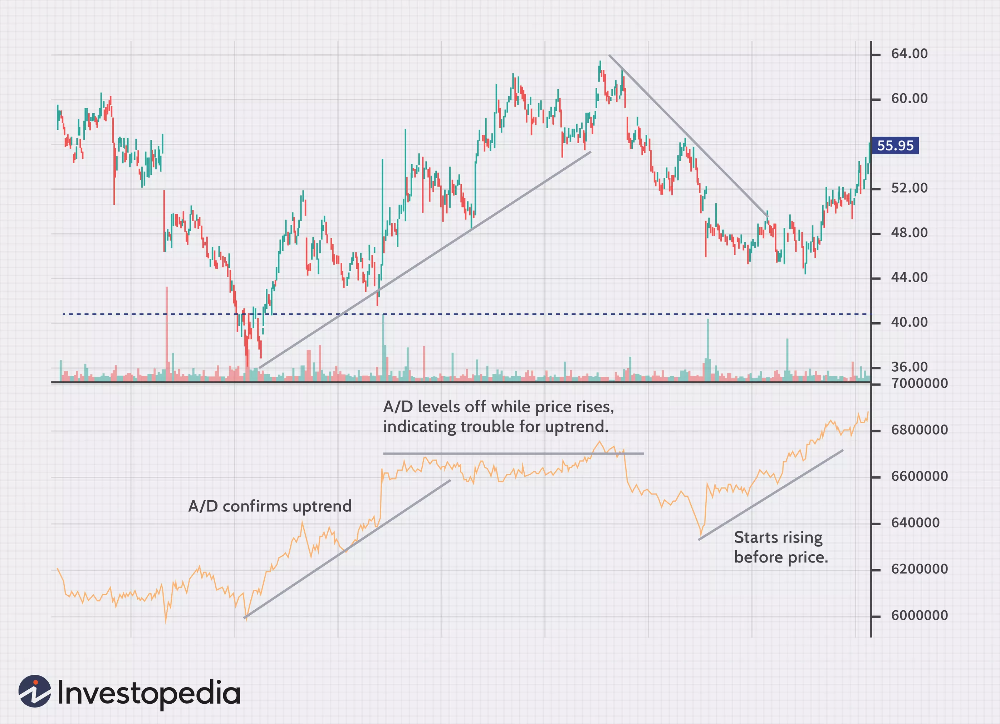
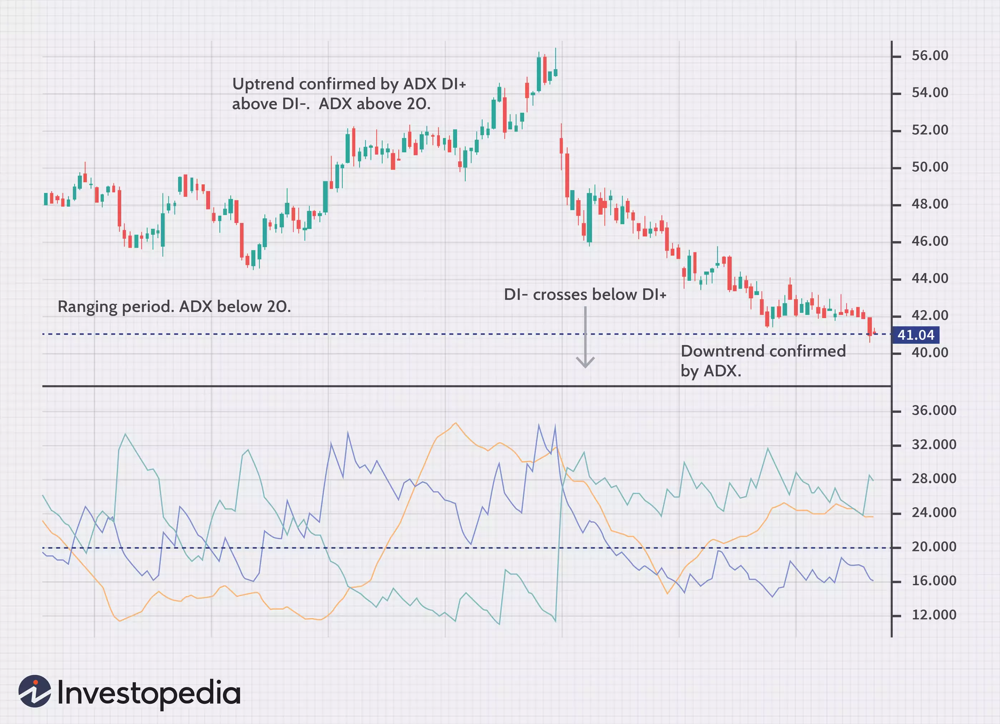
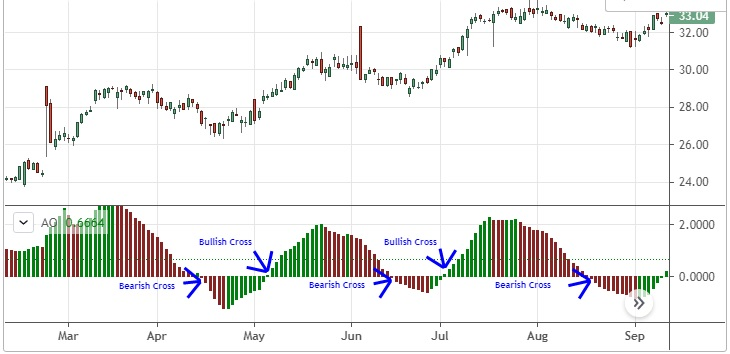
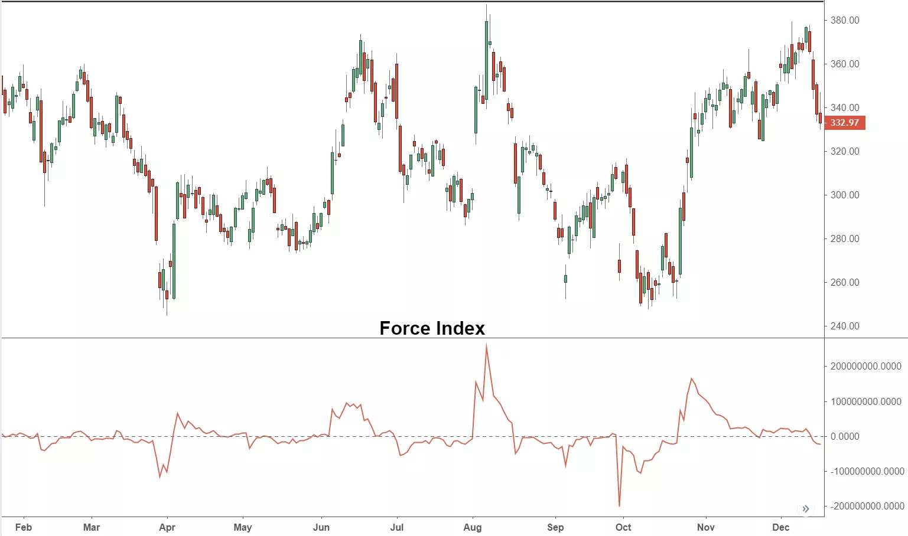
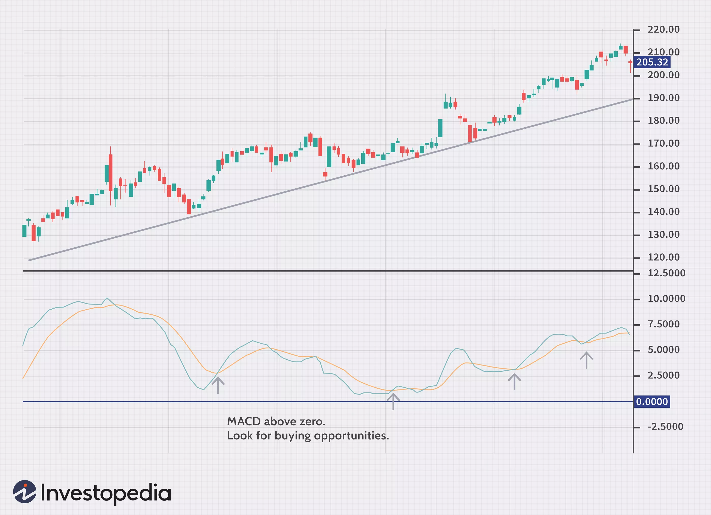
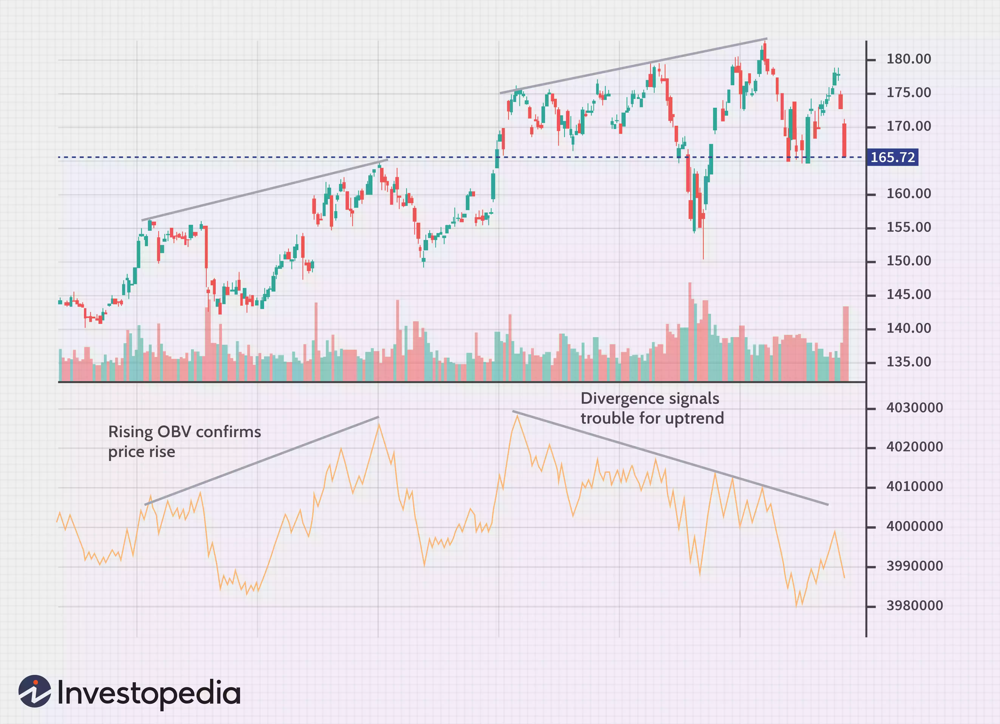
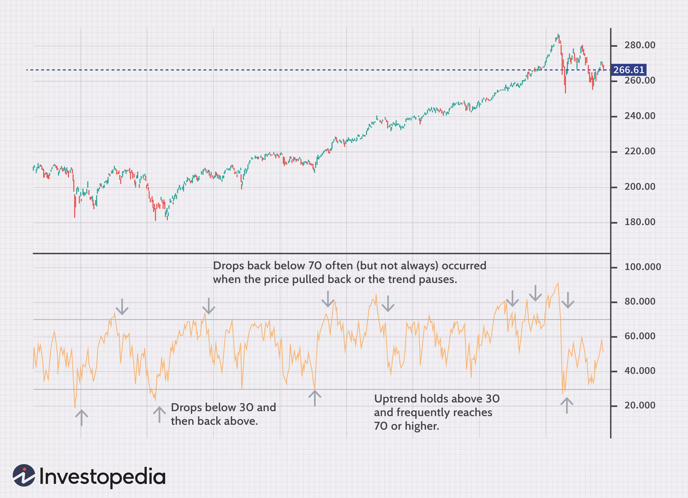
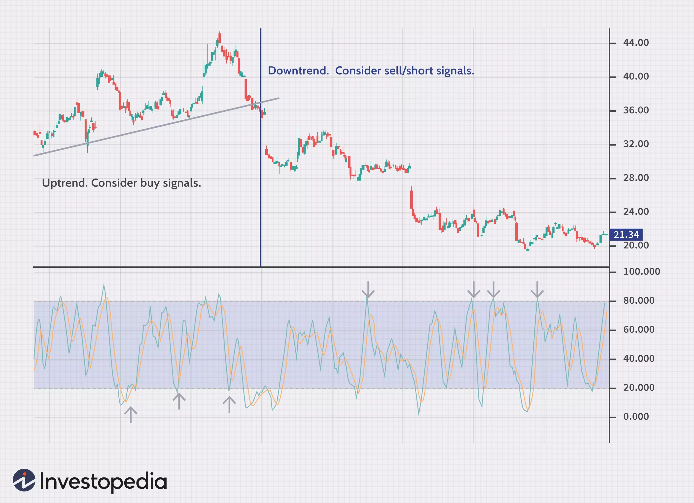

# Technical Analysis

This technical analysis is specifically adapted for [this package](https://github.com/anandanand84/technicalindicators) and for candles of 1 minute.

## Accumulation Distribution Line (ADL)
### Description
It is similar to the on-balance volume indicator (OBV), but instead of considering only the closing price of the security for the period, it also takes into account the trading range for the period and where the close is in relation to that range. If a stock finishes near its high, the indicator gives volume more weight than if it closes near the midpoint of its range. The different calculations means that OBV will work better in some cases and A/D will work better in others. 

### Inputs
`high`, `low`, `close`, `volume`

### Outputs
Array:
Total of up volume minus down volume.

### Interpretation
If the indicator line is trending up, it shows buying interest, since the stock is closing above the halfway point of the range. This helps confirm an uptrend. On the other hand, if A/D is falling, that means the price is finishing in the lower portion of its daily range, and thus volume is considered negative. This helps confirm a downtrend. 

Traders using the A/D line also watch for divergence. If the A/D starts falling while the price is rising, this signals that the trend is in trouble and could reverse. Similarly, if the price is trending lower and A/D starts rising, that could signal higher prices to come.

## Average Directional Index (ADX)
### Description
The average directional index (ADX) is a trend indicator used to measure the strength and momentum of a trend. When the ADX is above 40, the trend is considered to have a lot of directional strength, either up or down, depending on the direction the price is moving.

### Inputs
Object:
- `high` (array)
- `low` (array)
- `close` (array)
- `period` (integer of amount of candles, e.g. 14)

### Outputs
Object:
- `adx` (ADX)
- `pdi` (DI+)
- `mdi` (DI-)

### Interpretation
The ADX is the main line on the indicator, usually colored black. There are two additional lines that can be optionally shown. These are DI+ and DI-. These lines are often colored red and green, respectively. All three lines work together to show the direction of the trend as well as the momentum of the trend.

When the ADX indicator is below 20, the trend is considered to be weak or non-trending.

- ADX above 20 and DI+ above DI-: That's an uptrend.
- ADX above 20 and DI- above DI+: That's a downtrend.
- ADX below 20 is a weak trend or ranging period, often associated with the DI- and DI+ rapidly crisscrossing each other.

## Average True Range (ATR)
## Awesome Oscillator (AO)
### Description
The Awesome Oscillator is an indicator used to measure market momentum. AO calculates the difference of a 34 Period and 5 Period Simple Moving Averages. The Simple Moving Averages that are used are not calculated using closing price but rather each bar's midpoints. AO is generally used to affirm trends or to anticipate possible reversals.

### Inputs
Object:
- `high`
- `low`
- `fastPeriod` (integer, e.g. 5)
- `slowPeriod` (integer, e.g. 34)
- `format`: `(a)=>parseFloat(a.toFixed(2))`

### Outputs
Array:
- `AO`

### Interpretation
Zero Line Cross (other interpretations exist)

The most straightforward, basic signal generated by the Awesome Indicator is the Zero Line Cross. This is simply when the AO value crosses above or below the Zero Line. This indicates a change in momentum.

When AO crosses above the Zero Line, short term momentum is now rising faster than the long term momentum. This can present a bullish buying opportunity.

When AO crosses below the Zero Line, short term momentum is now falling faster then the long term momentum. This can present a bearish selling opportunity.

## Bollinger Bands (BB)
## Commodity Channel Index (CCI)
## Force Index (FI)
### Description
The force index is a technical indicator that measures the amount of power used to move the price of an asset. The term and its formula were developed by psychologist and trader Alexander Elder and published in his 1993 book Trading for a Living. The force index uses price and volume to determine the amount of strength behind a price move. The index is an oscillator, fluctuating between positive and negative territory.

### Inputs
Object:
- `close`
- `volume`
- `period` (integer, e.g. 13)

### Outputs
Array of FI. This array starts with the FI of the following period. As such when inputting 14 candles, it will output an array of 14 - period FI.

### Interpretation
A rising force index, above zero, helps confirm rising prices.
A falling force index, below zero, helps confirm falling prices.

## Know Sure Thing (KST)
## Moneyflow Index (MFI)

## Moving Average Convergence Divergence (MACD)
### Description
The moving average convergence divergence (MACD) indicator helps traders see the trend direction, as well as the momentum of that trend. It also provide a number of trade signals.

### Inputs
Object:
- `values` (close, array)
- `fastPeriod` (integer, e.g. 5)
- `slowPeriod` (integer, e.g. 8)
- `signalPeriod` (integer, e.g. 3)
- `SimpleMAOscillator` (boolean, e.g. false)
- `SimpleMASignal `(boolean, e.g. false)

### Outputs
Object:
- `MACD`
- `signal` (defined only from candle `signalPeriod` onward)
- `histogram` (defined only from candle `signalPeriod` onward)

### Interpretation
The indicator is composed of two lines: the MACD line and a signal line, which moves slower. When MACD crosses below the signal line, it indicates that the price is falling. When the MACD line crosses above the signal line, the price is rising. 

Looking at which side of zero the indicator is on aids in determining which signals to follow. For example, if the indicator is above zero, watch for the MACD to cross above the signal line to buy. If the MACD is below zero, the MACD crossing below the signal line may provide the signal for a possible short trade.

## On Balance Volume (OBV)
### Description
The indicator is a running total of up volume minus down volume. Up volume is how much volume there is on a candle when the price rallied. Down volume is the volume on a candle when the price falls. Each candle volume is added or subtracted from the indicator based on whether the price went higher or lower.

### Inputs
Object:
- `close` (array)
- `volume` (array)

### Outputs
Array:
Total of up volume minus down volume.

### Interpretation
When OBV is rising, it shows that buyers are willing to step in and push the price higher. When OBV is falling, the selling volume is outpacing buying volume, which indicates lower prices. In this way, it acts like a trend confirmation tool. If price and OBV are rising, that helps indicate a continuation of the trend.

Traders who use OBV also watch for divergence. This occurs when the indicator and price are going in different directions. If the price is rising but OBV is falling, that could indicate that the trend is not backed by strong buyers and could soon reverse.

## Parabolic Stop and Reverse (PSAR)
## Rate of Change (ROC)
## Relative Strength Index (RSI)
### Description
The relative strength index (RSI) has at least three major uses. The indicator moves between zero and 100, plotting recent price gains versus recent price losses. The RSI levels therefore help in gauging momentum and trend strength. 

### Inputs
Object:
- `values` (close, array)
- `period` (integer, e.g. 14)

### Outputs
Array (RSI)

### Interpretation
The most basic use of an RSI is as an overbought and oversold indicator. When RSI moves above 70, the asset is considered overbought and could decline. When the RSI is below 30, the asset is oversold and could rally. However, making this assumption is dangerous; therefore, some traders wait for the indicator to rise above 70 and then drop below before selling, or drop below 30 and then rise back above before buying. 

Divergence is another use of the RSI. When the indicator is moving in a different direction than the price, it shows that the current price trend is weakening and could soon reverse.

A third use for the RSI is support and resistance levels. During uptrends, a stock will often hold above the 30 level and frequently reach 70 or above. When a stock is in a downtrend, the RSI will typically hold below 70 and frequently reach 30 or below.

## Simple Moving Average (SMA)
## Stochastic Oscillator (KD)
### Description
The stochastic oscillator is a set of indicators that measures the current price relative to the price range over a number of periods. Plotted between zero and 100, the idea is that, when the trend is up, the price should be making new highs. In a downtrend, the price tends to makes new lows. The stochastic tracks whether this is happening.

### Inputs
Object:
- `high`
- `low`
- `close`
- `period` (integer, e.g. 14)
- `signalPeriod` (integer, e.g. 3)

### Outputs
Object:
- `k` (array, between 0 and 100)
- `d` (array, between 0 and 100)

### Interpretation
The stochastic moves up and down relatively quickly as it is rare for the price to make continual highs, keeping the stochastic near, 100 or continual lows, keeping the stochastic near zero. Therefore, the stochastic is often used as an overbought and oversold indicator. Values above 80 are considered overbought, while levels below 20 are considered oversold.

Consider the overall price trend when using overbought and oversold levels. For example, during an uptrend, when the indicators drop below 20 and rises back above it, that is possible buy signal. But rallies above 80 are less consequential because we expect to see the indicators to move to 80 and above regularly during an uptrend. During a downtrend, look for the indicators to move above 80 and then drop back below to signal a possible short trade. The 20 level is less significant in a downtrend.

## Stochastic RSI (StochRSI)
## Triple Exponentially Smoothed Average (TRIX)
## Typical Price
## Volume Weighted Average Price (VWAP)
## Volume Profile (VP)
## Exponential Moving Average (EMA)
## Weighted Moving Average (WMA)
## Wilder’s Smoothing (Smoothed Moving Average, WEMA)
## WilliamsR (W%R)
## Ichimoku Cloud